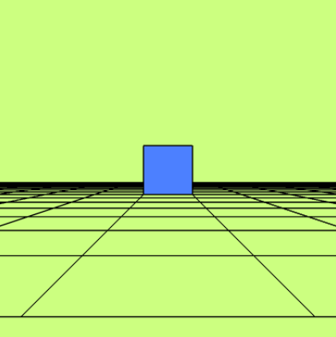
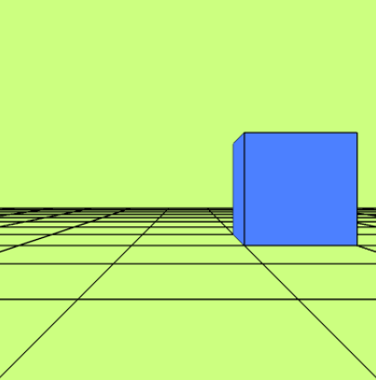
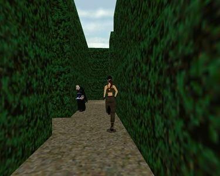
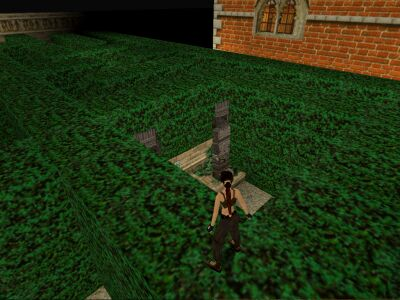
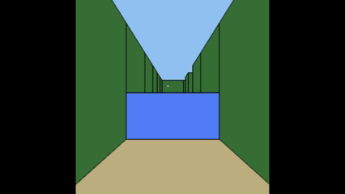

· Autoría: [Alejandro José Martel Torres](https://github.com/AlejandroMartel1)     - Acceso directo al proyecto: [CodeSandbox](https://codesandbox.io/p/sandbox/practica-4-forked-3rm42c)

# Laberinto 3D

En esta cuarta práctica partimos del desarrollo de un cubo sobre una rejilla cuadriculada que forma el suelo. Sobre ese plano podemos desplazarnos en dos direcciones, sin rotar el ángulo de vista, como se ve en las siguientes imágenes:

<table align="center">
  <tr>
    <td align="center">
      
      <br>
      <em>Figura 1. Cubo azul sobre la rejilla del suelo.</em>
    </td>
    <td align="center">
      
      <br>
      <em>Figura 2. El mismo cubo tras desplazarnos por el plano.</em>
    </td>
  </tr>
</table>

## Inspiración

Tomamos como referencia el laberinto mencionado en las posibles ampliaciones del guion y lo unimos al recuerdo de los laberintos de los videojuegos de finales del siglo pasado. Uno de ellos es *Tomb Raider*, donde la protagonista, Lara Croft, atraviesa laberintos de setos con formas cuadradas, más parecidas a un cubo que a los arbustos de un entorno natural.

<table align="center">
  <tr>
    <td align="center">
      
      <br>
      <em>Figura 3. Lara Croft recorriendo un pasillo del laberinto.</em>
    </td>
    <td align="center">
      
      <br>
      <em>Figura 4. Vista del laberinto desde lo alto de los setos.</em>
    </td>
  </tr>
</table>


Inspirándonos en este juego, hemos replicado el concepto de laberinto como un conjunto de cubos agrupados.

## El mapa

El laberinto se describe con un mapa de texto de 15 × 15 casillas (la constante `MAP`), siguiendo la convención de los ejemplos de *Advent of Code*. Cada carácter tiene el siguiente significado:

<div align="center">

| Carácter | Significado | Altura |
|:---:|---|:---:|
| `#` | Pared | 2,5 |
| `o` | Cubo azul | 1 |
| `.` | Casilla libre | 0 |

</div>


```
###############
#.....#.......#
#.###.#.#####.#
#.#...#.....#.#
#.#.#####.#.#.#
#...#..o..#...#
###.#.#######.#
#...#..o....#.#
#.#######.#.#.#
#...o...#.#...#
#.#####.#.###.#
#o#...#...#...#
#.#.#.#####.###
#...#.........#
###############
```

Cada casilla mide `CELL_SIZE = 2` unidades, así que el mundo ocupa 30 × 30 unidades y está centrado en el origen. La casilla de la fila `r` y la columna `c` tiene su centro en:

```
x = (c − 7) · CELL_SIZE
z = (r − 7) · CELL_SIZE
```


## Decisiones de desarrollo

### Movimiento del jugador

Para mejorar el movimiento del jugador, la dirección de la vista se expresa en coordenadas polares: un único ángulo, `ori`. El desplazamiento por el mapa sigue siendo cartesiano y rectilíneo. Estas son las teclas que permiten moverse:


<div align="center">

| Tecla | Acción |
|---|---|
| `W` / `↑` | Avanzar |
| `S` / `↓` | Retroceder |
| `A` / `D` | Desplazamiento lateral (izquierda / derecha) |
| `←` / `→` | Girar la vista |
| `Espacio` | Saltar |


</div>

A partir del ángulo `ori` se obtienen en cada frame dos vectores unitarios: hacia dónde mira el jugador y su derecha.

```
adelante = ( cos(ori), sin(ori) )
derecha  = (−sin(ori), cos(ori) )
```

### Salto y gravedad

El jugador puede saltar. En el eje vertical se aplica un movimiento uniformemente acelerado, integrado frame a frame:

```
vy   -= GRAVITY · dt
feet += vy · dt
```

La altura del salto se ha ajustado para que el laberinto tenga sentido: desde el suelo solo se puede subir a los cubos azules, y desde un cubo se puede saltar encima de las paredes. La altura máxima teórica es:

```
h = JUMP_SPEED² / (2 · GRAVITY) = 7,5² / (2 · 14,6) ≈ 1,93
```

Con el paso discreto `dt = 1/30`, la altura que se alcanza realmente es de unos 1,80:

- Desde el suelo: 1,80 > 1 (cubo), pero 1,80 < 2,5 (pared).
- Desde un cubo: 1 + 1,80 = 2,80 > 2,5, así que se alcanza la pared.

La gravedad (14,6) es mayor que la real (9,81) a propósito. Con la real, el salto sería más lento y daría una sensación "flotante".

**Nota:** el uso de la IA ha sido necesario para poder ajustar conceptos técnicos como la gravedad, este problema también se ha consultado en  foros que dan explicación al porqué la gravedad en los juegos tiene un valor superior al de la Tierra. 

### Colisiones

Cada casilla del mapa tiene una altura, y el jugador solo puede avanzar si lo que tiene delante no está más alto que sus pies:

- `cellHeight(x, z)` convierte una posición del mundo en casilla y devuelve su altura. Fuera del mapa devuelve infinito, así que el borde actúa como un muro.
- El jugador ocupa un cuadrado de 0,6 de lado. Como es más pequeño que una casilla, basta con comprobar sus cuatro esquinas (`maxHeightUnder`).
- `tryMove` comprueba cada eje por separado. Así, al chocar en diagonal con una pared, el jugador se desliza a lo largo de ella en lugar de quedarse pegado.

*Nota:* detalles técnicos en la gestión de la colisión tuvo que ser consultado a la IA.

Al caer, los pies se ajustan a la altura de la superficie sobre la que aterriza. Si el jugador sale andando del borde de un cubo, empieza a caer solo.


<p align="center">
  
  <br>
  <em> Animación gráfica del laberinto desarrollado, saltando sobre los cubos. </em>
</p>


## Fuentes de referencia o consulta


- [Vídeo de referencia (YouTube)](https://www.youtube.com/watch?v=dhodqY9NJL0)
- [Advent of Code](https://adventofcode.com/)
- [Gravity acceleration value in the game (Reddit)](https://www.reddit.com/r/hytale/comments/1qdaeqe/gravity_acceleration_value_in_the_game_approx/)
- [JS: how can I implement gravity (Stack Overflow)](https://stackoverflow.com/questions/17635010/js-how-can-i-implement-gravity)
- [Math for Game Programmers: Building a Better Jump](https://gdcvault.com/play/1023148/Math-for-Game-Programmers-Building)
- [Integration Basics](https://gafferongames.com/post/integration_basics/)


